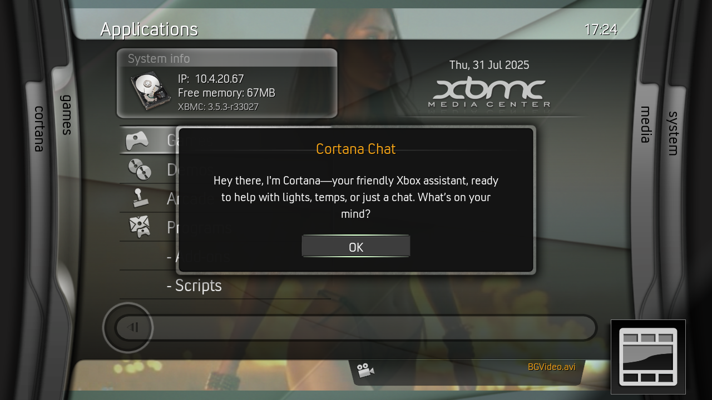

  

<h3 align="center">
  <a href="https://taterassistant.com">taterassistant.com</a>
</h3>

# Cortana AI for XBMC4Xbox

Cortana AI is a Tater-powered skin for the original Xbox. It brings assistant chat, TTS replies, quick asks, game recommendations, Tater Tube media browsing, live weather, and animated background video into an XBMC4Xbox dashboard.

  

## Highlights

- **Cortana AI:** ask from the Xbox, hear TTS replies, launch installed games, and use saved Quick Asks from the Cortana overlay.
- **Tater Tube:** pair with Tater Tube Server/Core and browse Tube TV, streams, local movies, series, and music from the Media blade.
- **Stellar Net ISO:** browse SMB-hosted ISO/CSO games and launch them through Project Stellar NetISO.
- **Tater blade:** view skin info, check for updates, install the latest release, and reload the skin from the dashboard.
- **Animated BGVideo:** downloads the release asset on first startup and plays it as the default dashboard background.
- **Tater weather:** pulls current weather from Tater Environment Core.

## Install

1. Install the XBMC / Original Xbox portal from Tater Shop.
2. Download the latest `skin.cortana.ai.zip` release.
3. Copy `skin.cortana.ai` to your XBMC4Xbox `skin` folder.
4. Switch to Cortana AI from XBMC Appearance settings.
5. Open Cortana settings and set your Tater API key if needed.
6. Open Tater Tube from the Media blade and pair it with your Tater Tube Server/Core.

`BGVideo.avi` is too large for the repo. On first startup, the skin downloads it from the latest GitHub release asset and stores it at `E:\BGVideo\BGVideo.avi`.

## Stellar Net ISO

Stellar Net ISO is on the Games blade. On first setup, enter the SMB share URL that Project Stellar maps as `net0`, then browse to the folder that contains your Xbox ISO/CSO files. The skin saves those settings and launches games through the bundled `attach.xbe` helper.

Stellar settings are in the Settings blade. Use that entry to change the SMB share, browse a new ISO folder, install/select the helper, or view the saved paths.

## Updating

Open the orange Tater blade, choose **Check Update**, then **Install Update**. The updater pulls the latest GitHub release through the XBMC portal and reloads the skin after staging the files.

## Requirements

- Original Xbox running XBMC4Xbox
- Tater with the XBMC / Original Xbox portal installed
- Tater Tube Server/Core for Tube TV, streams, local media, and music
- Project Stellar BIOS for Stellar Net ISO launching
- Network access from the Xbox to Tater

## Credits

Built on JX720 and MC360 work by Jezz_X, Team Blackbolt, and faithvoid. Uses Open Sans by Steve Matteson. Stellar Net ISO uses the unmodified `attach.xbe` helper from MakeMHz `stellar-attach`; see `scripts/stellar/THIRD_PARTY_NOTICES.txt`.
